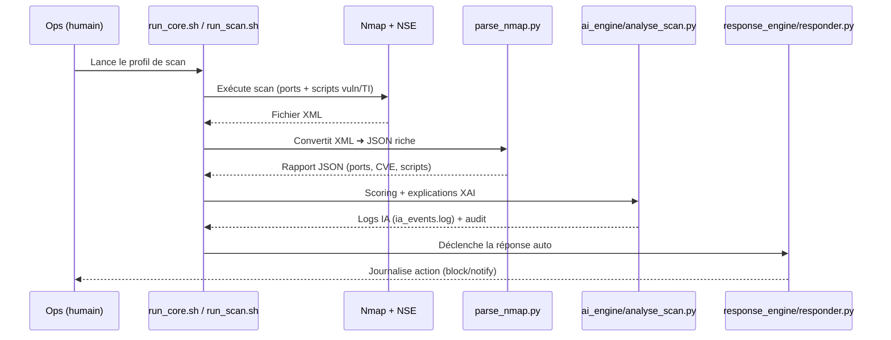
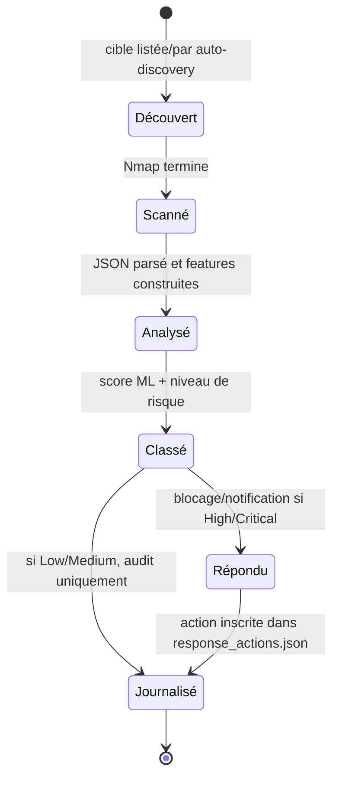

# Chapitre 2 — Fondations théoriques pour TRUSTED-AI-SOC-LITE

## 2.1 Introduction

**Contexte général.** Les réseaux d’entreprise, même réduits à une seule machine ou à un petit LAN, sont exposés à des campagnes d’attaque opportunistes (scan massif, exploitation de services vulnérables, credential stuffing) et à des menaces ciblées (ransomware, spear-phishing, mouvements latéraux). Un SOC local et léger doit donc offrir un minimum de visibilité et de réaction autonome sans dépendre d’une infrastructure lourde.

**Rôle de l’étude théorique.** Ce chapitre structure les concepts de cybersécurité, de scanning réseau, d’IA/XAI et de réponse automatique qui sous-tendent TRUSTED-AI-SOC-LITE. Il sert de trame pédagogique pour justifier les choix techniques implémentés dans les modules `nmap_scanner/`, `ai_engine/` et `response_engine/`.

**Technologies et concepts abordés.** Scans Nmap (TCP/UDP, détection de services/OS, scripts NSE vuln/TI), modèles ML (RandomForest), explicabilité (SHAP, LIME), Threat Intelligence (scores CVSS, CVE), et automatisation de réponses (UFW, notifications e-mail).

**Lien théorie → mise en œuvre.** Chaque notion est reliée à un composant concret :
- Découverte et reconnaissance ➜ `nmap_scanner/run_scan.sh` + `parse_nmap.py` (XML → JSON riche).
- Scoring/explication ➜ `ai_engine/analyse_scan.py` + `feature_engineering.py` + SHAP/LIME facultatifs.
- Réaction ➜ `response_engine/responder.py` + `ufw_actions.sh` + `mailer.py`.

## 2.2 Concepts fondamentaux de la Cybersécurité

### 2.2.1 Définition du système d’information
- **Composants** : postes utilisateurs, serveurs, services réseau (SSH, HTTP, bases de données), équipements réseau, comptes et identités.
- **Enjeux** : disponibilité (services joignables), intégrité (données non altérées), confidentialité (accès restreint), traçabilité (logs/audit).
- **Vulnérabilités principales** : services obsolètes, configurations faibles (FTP anonyme, mots de passe par défaut), ports exposés inutilement, composants non corrigés (CVE connues), chiffrement faible.

### 2.2.2 Menaces et attaques informatiques
- **Malware / DoS-DDoS** : charge malveillante, saturation de ressources réseau ou applicatives.
- **Scan d’énumération** : découverte d’hôtes/ports/services pour préparer l’exploitation.
- **Reconnaissance active vs passive** : paquets envoyés (active) vs collecte de traces existantes (logs, DNS, passif).
- **Vulnérabilités CVE** : failles référencées, évaluées via CVSS ; elles sont extraites dans le pipeline pour enrichir le score de risque.

### 2.2.3 Notions de défense informatique
- **Prévention** : durcissement, réduction de surface d’attaque, mises à jour.
- **Détection** : veille sur les événements réseau/host, corrélation avec signatures ou modèles IA.
- **Réaction** : blocage IP, isolation d’hôte, notifications.
- **Surveillance continue (SOC)** : boucle collecte ➜ analyse ➜ décision ➜ action ➜ audit.

## 2.3 Le Centre Opérationnel de Sécurité (SOC)

### 2.3.1 Définition et rôle d’un SOC
Cellule (ou pile logicielle) qui collecte, corrèle et réagit aux événements de sécurité pour réduire le temps de détection (MTTD) et de réponse (MTTR).

### 2.3.2 Missions principales
- **Monitoring** : observation continue des scans, logs et anomalies.
- **Détection** : identification de comportements suspects ou vulnérabilités critiques.
- **Investigation** : qualification, priorisation.
- **Réponse** : mesures techniques (firewall) ou organisationnelles (alerte).
- **Amélioration continue** : ajustement des règles, modèles et playbooks.

### 2.3.3 Limites des SOC traditionnels
- **Coût** (licences/infra), **complexité** (intégration SIEM), **volume d’alertes** (fatigue analyste), **manque d’explicabilité** (boîtes noires ML).

### 2.3.4 Vers un SOC intelligent
- **Automatisation** des tâches répétitives (scan, parse, réaction).
- **IA dans la cybersécurité** pour scorer et prioriser.
- **SOC local et léger** : une seule machine Debian avec Nmap + IA + réponse, sans dépendance externe obligatoire.

## 2.4 Scan réseau et technologies de reconnaissance

### 2.4.1 Introduction au scanning
- **Objectifs** : découvrir hôtes, services, versions, éventuelles failles.
- **Types de scans** : ping sweep, TCP SYN/CONNECT, UDP, détection de service/version, scripts NSE ciblés vuln/malware/auth.

### 2.4.2 Présentation de Nmap
- **Fonctionnement** : envoi de sondes, analyse des réponses pour inférer état des ports et bannières.
- **Types de scans** : SYN (`-sS`), UDP (`-sU`), détection service/version (`-sV`), scripts NSE (`--script`), OS fingerprinting (`-O`).
- **Sorties** : XML (`-oX`) pour le parseur, JSON/TXT via conversion (`parse_nmap.py`).

### 2.4.3 Interprétation des résultats de scan
- **Ports ouverts** : surface d’attaque potentielle.
- **Services** : versions, protocoles, options (SSH algos, HTTP headers…).
- **Vulnérabilités potentielles** : CVE via NSE (`vulners`), mauvaises configs (FTP anonyme, SSL faible).
- **Transformation XML → JSON** : `parse_nmap.py` extrait hôtes, ports, scripts, CPE/CVEs pour l’IA.

## 2.5 Intelligence Artificielle appliquée à la Sécurité

### 2.5.1 Rappels sur le Machine Learning
- **Apprentissage supervisé** : exemples étiquetés (faible/moyen/élevé/critique).
- **Dataset** : historiques de scans (features) + labels ou scores.
- **Feature engineering** : construction d’attributs (nb ports critiques, CVSS max, protocole sensible, surface HTTP/SSH/SMB, OS).
- **Entraînement / validation / test** : split des données pour éviter l’overfitting.

### 2.5.2 Modèle RandomForest
- **Principe** : agrégation d’arbres de décision pour réduire la variance.
- **Avantages** : robuste au bruit, gère variables mixtes, importance de features interprétable.
- **Limites** : modèle plus volumineux, moins extrapolatif hors distribution.
- **Pourquoi ici ?** Bon compromis précision / explicabilité pour scorer des hôtes à partir de ports/services/CVE.

### 2.5.3 Classification du niveau de risque
- **Étiquettes** : Low / Medium / High / Critical (seuils sur score 0–100).
- **Choix des features** : compte de ports, services sensibles, CVSS max/moyen, présence NSE vuln/exploit, empreinte OS, RTT.
- **Prédiction** : `analyse_scan.py` génère `risk_score` + `risk_level` et les écrit dans `logs/ia_events.log` et `audit/ia_decisions.json`.

## 2.6 IA Explicable — XAI

### 2.6.1 Introduction à l’explicabilité
- **Importance** : confiance, audit, capacité à justifier un blocage réseau.
- **Transparence** : montrer quelles features ont conduit à la décision.

### 2.6.2 Méthode SHAP
- **Principe** : contribution marginale de chaque feature (théorie des jeux).
- **Global vs local** : importance moyenne (global) ou explication d’un hôte (local).
- **Visualisation** : barplot, waterfall, force plot.

### 2.6.3 Méthode LIME
- **Principe** : perturbation locale et régression linéaire pour approximer le modèle.
- **Comparaison** : LIME rapide et local, SHAP plus cohérent globalement.

### 2.6.4 Rôle de la XAI dans un SOC
- **Confiance** : expliquer pourquoi une IP est bloquée.
- **Validation humaine** : analyste peut confirmer/infirmer.
- **Documentation automatique** : traces exploitables pour les audits.

## 2.7 Mécanismes de réponse automatique

### 2.7.1 Défense active
- Blocage IP, isolation temporaire, escalade vers l’équipe sécurité.

### 2.7.2 UFW Firewall
- **Présentation** : pare-feu simple sur Debian.
- **Règles** : `ufw deny from <IP>` / `ufw delete deny from <IP>`.
- **Commandes essentielles** : activation, statut, journalisation.

### 2.7.3 Envoi d’alertes et notifications
- **Email** : `mailer.py` pour notifier en cas de High/Critical.
- **Journalisation** : `response_engine/responder.py` ajoute `response_actions.json` pour garder la trace.

## 2.8 Audit et journalisation

### 2.8.1 Importance du logging
- **Traçabilité** des décisions IA et actions réseau.
- **Conformité / forensics** : capacité à rejouer et comprendre un incident.

### 2.8.2 Format des logs
- **JSON** privilégié pour l’ingestion par d’autres outils.
- **Horodatage** : ISO 8601 (UTC, suffixe Z).
- **Données de décision IA** : `host`, `risk_score`, `risk_level`, `top_findings`, `cves`, `ports`.

### 2.8.3 Architecture d’un système d’audit SOC
- **Pipeline** : scan ➜ IA ➜ action ➜ logs.
- **Stockage** : fichiers `audit/*.json`, `logs/ia_events.log`.
- **Exploitation** : visualisation locale (tableur, script Python, dashboard React facultatif) ou intégration future dans un SIEM.

## 2.9 Conclusion

- **Résumé** : ce chapitre a posé les notions de base (système d’information, menaces, scanning, ML, XAI, réponse, audit) nécessaires pour concevoir TRUSTED-AI-SOC-LITE.
- **Importance pour la suite** : ces fondations théoriques justifient les choix du Chapitre 3 (architecture logicielle et déploiement Debian) et garantissent la cohérence du pipeline Nmap ➜ IA/XAI ➜ réponse automatique.
- **Transition** : le chapitre suivant décrit la conception détaillée et l’implémentation de la solution complète.

## 2.10 Diagrammes UML (vue synthétique du projet)

Les diagrammes ci-dessous offrent une vue compacte et standardisée (UML) des interactions clés du pipeline Nmap ➜ IA/XAI ➜ Réponse, sans dépendance à un SIEM externe.

### 2.10.1 Diagramme de séquence — de la découverte au blocage



### 2.10.2 Diagramme de cas d’utilisation — SOC local sans SIEM

```mermaid
usecaseDiagram
    actor "Opérateur SOC" as Ops
    actor "Hôte scanné" as Host

    rectangle "TRUSTED-AI-SOC-LITE" {
        usecase UC1 as "Lancer un scan Nmap"
        usecase UC2 as "Analyser les résultats (IA/XAI)"
        usecase UC3 as "Consulter les journaux IA"
        usecase UC4 as "Appliquer une réponse automatique"
        usecase UC5 as "Exporter l’audit (JSON)"
    }

    Ops --> UC1
    Ops --> UC2
    Ops --> UC3
    Ops --> UC5
    UC1 --> Host
    UC1 --> UC2
    UC2 --> UC3
    UC2 --> UC4
    UC4 --> Host
```

### 2.10.3 Diagramme d’activité — pipeline complet

```mermaid
flowchart TD
    A([Démarrer run_core.sh]) --> B[Découverte des cibles (auto ou targets.txt)]
    B --> C[Scan Nmap (profil choisi)]
    C --> D[Parse XML ➜ JSON]
    D --> E[Extraction de features + TI]
    E --> F[Scoring ML/heuristique]
    F --> G[Explications XAI (SHAP/LIME opc.)]
    G --> H[Écriture logs IA + audit]
    H --> I{Niveau de risque ?}
    I -->|Low/Medium| J[Traçabilité uniquement]
    I -->|High/Critical| K[Réponse auto: UFW/alertes]
    J --> L([Fin])
    K --> L
```

### 2.10.4 Diagramme d’état / transition — cycle d’un hôte scanné


